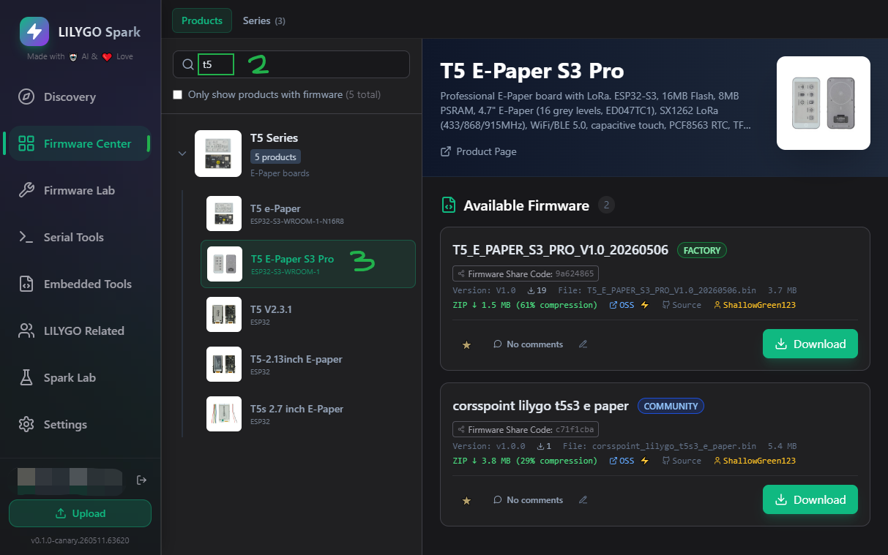

# T5S3 Reader

[](https://github.com/ShallowGreen123/t5s3-reader/actions/workflows/platformio-build.yml)

English | [中文](README_CN.md)

Firmware for the **LilyGo T5 ePaper S3 / T5S3 4.7-inch e-paper device**.

This project is adapted from CrossPoint Reader and focuses on the LilyGo T5S3 hardware. It includes practical fixes and optimizations for EPUB images, TXT loading speed, low-power shutdown, startup refresh behavior, and general e-paper reading.

## Thanks

Special thanks to [CrossPoint Reader](https://github.com/crosspoint-reader/crosspoint-reader). This firmware keeps and builds on CrossPoint's activity-based UI architecture, reader logic, settings system, SD-card cache, web file transfer, and many other foundations.

This repository is not the official CrossPoint project and is not affiliated with LilyGo. It is an adaptation and experimental firmware for T5S3 devices.

## Target Device

- **Device**: [LilyGo T5 ePaper S3](https://github.com/Xinyuan-LilyGO/T5S3-4.7-e-paper-PRO)
- **MCU**: ESP32-S3
- **Display**: 4.7-inch e-paper, 960 x 540 physical resolution, 540 x 960 default portrait logical resolution
- **Storage**: microSD card for books, cache, settings, and screenshots
- **Input**: front buttons, side buttons, power button, reset button, and touch screen

The PlatformIO environment is `default`, and the board definition is `T5-ePaper-S3`.

## Features

- EPUB reading with chapter parsing, layout, saved progress, and image support.
- TXT / Markdown reading.
- XTC reading.
- BMP image viewer.
- Recent books, file browser, reading cache, cover images, and sleep screen images.
- Wi-Fi file upload and web-based file management.
- Configurable fonts, font size, line spacing, margins, orientation, and refresh mode.
- Auto power-off after long inactivity when USB is not connected.
- Reader screenshots saved to the SD card under `screenshots/`.

## Requirements

- LilyGo T5 ePaper S3 device
- microSD card
- USB-C data cable
- Python 3
- PlatformIO Core, or VS Code with the PlatformIO extension

Install PlatformIO Core:

```bash
python -m pip install platformio==6.1.19
```

Clone the repository and enter the project directory:

```bash
git clone <repository-url>
cd z-T5S3-Reader
```

## Download Firmware To The Device

### Option 1: LILYGO Spark, Recommended

1. Download and open [LILYGO Spark](https://lilygo.cc/en-us/pages/lilygo-spark?srsltid=AfmBOoorTB7ptFu2LQNLRnoI2SA0zBGJTN6JpI9J3hmHEkKhBQSmeu0Y).
2. Search for your device and install the `corsspoint_lilygo_t5s3_e_paper` firmware.



### Option 2: PlatformIO

1. Connect the device to your computer with USB-C.
2. Build the firmware:

```bash
pio run -e default
```

3. Upload it to the device:

```bash
pio run -e default -t upload
```

4. If upload mode is not detected, hold the BOOT button and press RESET, or hold BOOT while reconnecting USB, then run the upload command again.

5. Open the serial monitor if logs are needed:

```bash
pio device monitor -b 115200
```

### Option 3: esptool

Install esptool:

```bash
python -m pip install esptool
```

After building, the firmware is located at:

```text
.pio/build/default/firmware.bin
```

Flash only the application firmware:

```bash
esptool.py --chip esp32s3 --port COMx --baud 921600 write_flash 0x10000 .pio/build/default/firmware.bin
```

For a blank device or a full restore, flash bootloader, partition table, and firmware:

```bash
esptool.py --chip esp32s3 --port COMx --baud 921600 write_flash \
  0x0000 .pio/build/default/bootloader.bin \
  0x8000 .pio/build/default/partitions.bin \
  0x10000 .pio/build/default/firmware.bin
```

Replace `COMx` with your serial port, such as `COM5` on Windows, `/dev/ttyACM0` on Linux, or `/dev/cu.usbmodem*` on macOS.

## SD Card And Books

Put books directly in the SD card root directory, or organize them into folders.

Recommended layout:

```text
/
  Books/
    book.epub
    novel.txt
  .sleep/
    sleep.bmp
```

The firmware creates a `.crosspoint/` directory on the SD card for settings, reading progress, cache, and cover thumbnails. If cache corruption or repeated crashes occur, back up the SD card and delete `.crosspoint/` to let the firmware regenerate it.

## Device Operation

### Basic Buttons

| Button | Function |
| --- | --- |
| BOOT | Short press: previous item / previous page |
| IO48 | Short press: next item / next page |
| BOOT | Long press: confirm / open |
| IO48 | Long press: power off |
| PWR | Turn on device power |
| RTS | Reset |
| HOME | Return to home screen |

### Power

- Long press `PWR` to turn on the device.
- Long press `IO48` to power off.
- When there is no activity for a long time and USB is not connected, the device enters power-off / low-power state automatically.
- If the device stops responding, press RESET and then long press the power button again.

### Home Screen

The home screen provides:

- Continue Reading: reopen the most recent book.
- Browse Files: browse files on the SD card.
- Recent Books: view recently opened books.
- File Transfer: upload books over Wi-Fi.
- Settings: configure the device.

Use Left/Right or Up/Down to move, Confirm to open, and Back to return.

### File Browser

- Left / Up: move up.
- Right / Down: move down.
- Confirm: open a file or folder.
- Back: go to the parent folder or return home.
- Long press Confirm: delete the selected file after confirmation.

### Reading

- Right or Down: next page.
- Left or Up: previous page.
- Confirm: open the reader menu.
- Back: exit reading and return home.
- Long press Back: exit reading and return to the file browser.
- Long press page keys: chapter skip or other configured long-press behavior.
- Power + Down: take a screenshot and save it under `screenshots/` on the SD card.

### Wi-Fi Book Upload

1. Open `File Transfer` from the home screen.
2. Select and connect to Wi-Fi.
3. The device displays a web address.
4. Open the address in a browser on your computer or phone.
5. Upload EPUB, TXT, or other supported files to the SD card.
6. Press Back on the device to exit file transfer mode.

## Common Settings

In `Settings`, you can configure:

- Font, font size, line spacing, and page margins.
- Reading orientation: portrait, landscape, inverted, and more.
- Refresh mode: quality, balanced, or fast.
- EPUB image rendering: show images, placeholders, or hide images.
- Sleep / power-off timeout.
- Sleep screen: default image, blank screen, custom BMP, or book cover.
- Button mapping.
- Wi-Fi networks.

## Notes

This firmware is still being tuned. E-paper refresh, image decoding, large TXT loading, power consumption, and battery reporting can vary with hardware state. If something goes wrong, please provide serial logs, reproduction files, and exact steps when possible.

Thanks again to CrossPoint Reader and all related open-source library authors.
